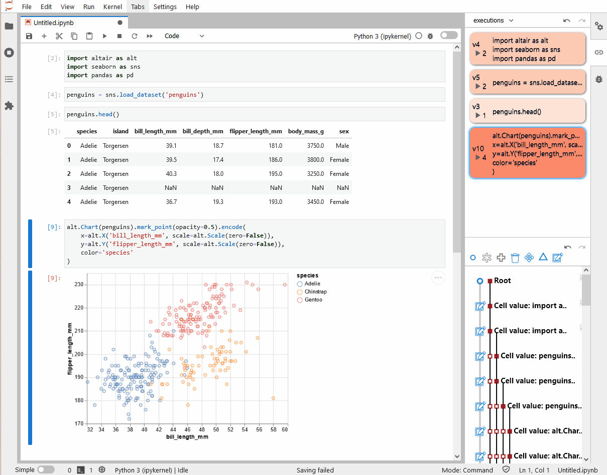

# JupyterLab Notebook Provenance

 

An extension for JupyterLab (v2+) to track interaction provenance in Jupyter notebooks.  
The provenance information is stored using the provenance tracking library [trrack]((https://github.com/visdesignlab/trrack)).

This extension listens to notebook change events from JupyterLab and stores these changes as a provenance graph with Trrack.
The [trrack-notebook-vis](https://github.com/JKU-ICG/trrack-notebook-vis) library takes the stored provenance information to visualize the provenacne graph in a sidepanel in JupyterLab.
From the visualization, users can browse the notebook's history, filter it, and switch between states.

:rocket: Try it out on Binder: [](https://mybinder.org/v2/gh/JKU-ICG/jupyterlab_nbprovenance/demo?urlpath=lab)



## Install

Install [JupyterLab](http://jupyterlab.readthedocs.io/en/latest/getting_started/installation.html) if you haven't already.

To install the extension from the terminal, type:

```sh
jupyter labextension install @jku-icg/jupyterlab_nbprovenance
```

### Binder
To use the extension in a JupyterLab instance from [Binder](mybinder.org/), add a *postBuild* file with the above command to the root of the repository (see the [demo branch](https://github.com/JKU-ICG/jupyterlab_nbprovenance/tree/demo) for reference).

## Development

1. Prepare Environment (optional)

    ```sh
    conda create --name notebook_provenance python=3.8.5
    conda activate notebook_provenance
    conda install jupyterlab
    ```

1. Clone this repo, `cd` into the folder
1. Then build the extension

    ```sh
    npm install
    npm run build
    ```

1. Install the extension

    ```sh
    jupyter labextension install --minimize=False # install the current directory as an extension
    ```

    Disabling the minifier is optional, but minimizig the code is not necessary locally and it reduces the build time.

1. Start JuypterLab in watch mode

    ```sh
    jupyter lab --watch
    ```

1. Make code changes
1. Rebuild the extension with `npm run build` or watch for file changes and built automatically with `npm run watch`  
    JupyterLab updates itself, due to the `--watch` parameter
1. Refresh the JupyterLab in your browser to load the updated files

Also see the [JuypterLab Extension Developer Guide](https://jupyterlab.readthedocs.io/en/stable/developer/extension_dev.html#extension-authoring).

## Publish

Make sure to `npm login` with the user *icgbot* first.

```sh
npm pack --dry-run  # verify files
npm publish
```

## Attributions

This extension uses icons by [fontawesome.com](https://fontawesome.com/), available under [CC BY 4.0](https://creativecommons.org/licenses/by/4.0/).
